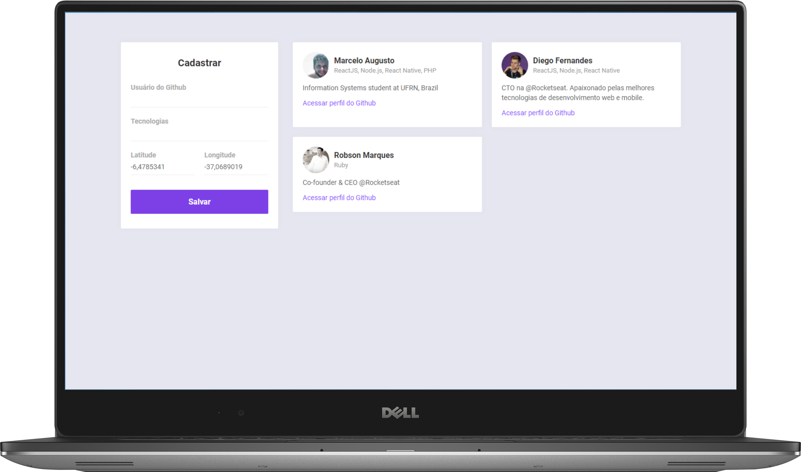

# Semana Omnistack 10 | Findev

A aplicação desenvolvida na 10ª Semana Omnistack permite que desenvolvedores sejam cadastrados, informando github, tecnologias preferidas e sua localização. O objetivo é mapeá-los de forma que outros desenvolvedores possam se encontrar através de tecnologias em comum.

A aplicação está sendo desenvolvida com **Node JS** no *backend*, **React JS** no *frontend* e **React Native** no *mobile*: no *frontend* será possível cadastrar os desenvolvedores; e no *mobile*, será possível buscar os desenvolvedores mais próximos.

# Funcionalidades da aplicação

* *CRUD* de Desenvolvedores;
* Busca de desenvolvedores por tecnologia e por raio de proximidade (10 Km é o padrão);

# Bibliotecas utilizadas

* Axios 
* Express
* Mongoose
* Nodemon
* Cors

# Instruções para execução do *backend*

> Certifique-se de ter as seguintes ferramentas instaladas em sua máquina: **Node** e **Yarn**. Além dessas, também será necessário ter o banco de dados **MongoDB** rodando em sua máquina.

* Utilizando o **Docker**, você pode executar o comando abaixo para que o download de uma imagem do **MongoDB** seja efetuado:
  ```
  docker run --name nome-da-imagem -d mongo
  ```
  * Para inicializar, basta rodar:
    ```
    docker start nome-da-imagem
    ```

* Após fazer o download do projeto ou clonar o repositório, execute o comando `yarn` para que o gerenciador baixe todas as dependências necessárias para executar o projeto;

* Após finalizar o download, execute `yarn dev` e o servidor estará rodando.

# Instruções para execução do *frontend*

* Após fazer o download do projeto ou clonar o repositório, execute o comando `yarn` na pasta `web` para que o gerenciador faça o download de todas as dependências necessárias;

* Após finalizar, execute `yarn start` para que o projeto execute.

# Instruções para execução do *mobile*
> A aplicação foi desenvolvida utilizando o **Expo**. Para executá-la em seu dispositivo, você deverá ter o aplicativo do Expo instalado.

* Após fazer o download do projeto ou clonar o repositório, execute o comando `yarn` na pasta `mobile` para que o gerenciador faça o download de todas as dependências necessárias;

* Após finalizar, execute `yarn start` para inicializar a aplicação;

* Abra o aplicativo do expo e escaneie o QRCode gerado;

# Interfaces
